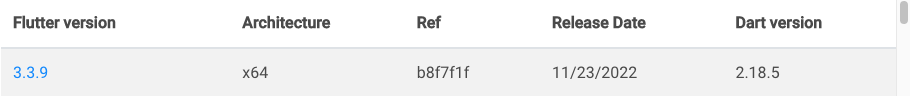

# Gutendex Flutter Coding Challenge

This is a Flutter-based project, implementing the clean-architecture on the main module and some multi-package as a tools. 

## Project Specification

Create an application that fetches data from the Gutenberg Library API to display books from their library. 

**Gutenberg API**: [http://gutendex.com/](https://github.com/pahlevikun/thegoatjp)

**Latest Stable Flutter** as of 15 December 2022




**Required functionality**

- Create an initial screen with a list/grid of books from Gutenberg Library's collection
  - Implement a search functionality
  - Implement an infinite scroll pagination
- A screen with details of a certain book of the collection.
  - This screen is opened when you tap an item in the initial screen. 
  - What to display (title, cover, author, etc.) is up to you
- A third screen containing a list/grid of books that share the same characteristics.
  - This screen is accessed when you tap one of the details in the detail screen
  - e.g. Tapping on author name "Jane Austen" would show a list of other books by "Jane Austen"

**Submission Repository :** [https://github.com/pahlevikun/thegoatjp](https://github.com/pahlevikun/thegoatjp)


The app is built using Android Studio setup, so there's some steps for opening and running the app. Below is tools and some dependencies that used to build this app:

1. Flutter v3.3.9, as the SDK.
2. Flutter Version Manager, as tools to manage Flutter SDK in specific project.
3. Android Studio Dolphin + Flutter plugin + Dart plugin, as IDE and some tools.
4. Bloc as design pattern.
5. Clean architecture as design philosophy to separates the elements into some layer.
6. Injectable and GetIt as dependencies locator (or some says flutter DI).
7. Dio, Retrofit, JsonSerializable, RxDart to handle the network request and manipulating stream.

## Assumptions

- Select A or B as a situation you are in. See situations below.
- Write the selected situation in [README.md](http://readme.md/), indicating your decision making revolving around your selected situation. You can write this however you like.
- The selection of A or B itself has no impact to your evaluation.

**A. Coach a junior engineer**

A junior Flutter engineer joined to your team. To coach the engineer, you are going to demonstrate implementation of a sample app. The structure of the app should be as simple as possible.

**B. Design and implement an app as a long term project**

You are a tech-lead of a Flutter team with 5 members. The team is going to develop a new Flutter app. It is supposed to be a long term project to develop and maintain the app within the team. Before starting the development with the team members, you are going to design the app and implement fundamental functionalities as the tech lead.

---

### Selected case

Basically this project structure is able and ready to be scaled up, but from my perspective to make all of team member highly decoupled each other, also the project need to adapt multi-module approach with some module levelling rules. So currently, this project is more suitable for a simple project that can be used for training new joiner since the structure is pretty straight forward following the Clean Architecture, Bloc pattern, and some similarities approach with Native apps development, especially in Android development. So I choose scenario A. Last, I'm sorry I only done unit test for use-case.


## Getting Started


### 1. Setup your Flutter Environment

Since I'm working on a mac machine, what you need is to install HomeBrew first, after that you need to install Flutter Version Manager (FVM) on your machine:

```shell script
brew tap leoafarias/fvm
brew install fvm
```
For more information, kindly visit:

 - [https://fvm.app/](https://github.com/fluttertools/sidekick)
 - [https://github.com/fluttertools/sidekick](https://github.com/fluttertools/sidekick)

After you install Flutter Version Manager, you need to install Flutter SDK using FVM, FVM is a very
helpful tool for managing different flutter versions on multiple projects:

```shell script
fvm install
fvm use 3.3.9 --force
```


### 2. Setup your IDE

Basically I'm more familiar with Android Studio, which is an Intellij IDE. That's why I used this IDE, So if you are using Visual Studio code, you can adjust based on your needs. 

1. First is to download the Android Studio itself, please visit: [https://developer.android.com/studio](https://developer.android.com/studio) and download Android Studio Dolphin.
2. After installing, you need to add Flutter and Dart plugin to your Android studio.
3. Next step is to open this project.
4. After opening this project, you need to set your Flutter SDK first, just open your Android Studio preferences, or you can just press `command` + `,`, go to Languages & Frameworks, then select Flutter, and set the path of your SDK. If you already install Flutter using FVM, you can just target SDK path to .fvm/flutter_sdk file inside the project.


	
5. Apply and restart your IDE.
6. After done, kindly run custom script for generating the files first. ```bash make_project.sh```.
7. To run the project, select device first and just do it like usually running the Android app using Android Studio.
	


### Architecture & Rule of Layering

Basically, there is 3 types of layer following the famous uncle Bob's clean architecture, which are
Data, Domain, and Presentation layer.

Below is the outline of the architecture showing the communication for between each layer:


As you can see image above, the project used simple clean-architecture, the project not use
uni-direction flow (data >> domain >> presentation) on the clean-architecture to avoid verbose code,
so the domain will be acting as a middleman between data and presentation layer (data >><< domain >><< presentation), 
there's several rules:

1. The data layer consist of repository and some repositories. Repositories are responsible to
   coordinate data from the different Data Sources such as location updates, preferences, databases,
   or something like remote config. Data Layer depends on Domain Layer.
2. The domain layer consist of use-cases, some interface as contract between data and domain layer,
   and entities. The domain didn't depends with the others layer, it will act as middleman between
   data and presentation.
3. The presentation contains UI (Activities & Fragments) that are coordinated by
   Presenters/ViewModels which execute 1 or multiple Use cases. Presentation Layer depends on Domain
   Layer, but to consume domain the data layer need to be initialized inside the presentation.

## Results

### Android

<div>
 
 
 
 
</div>

### iOS

<div>
 
 
 
</div>